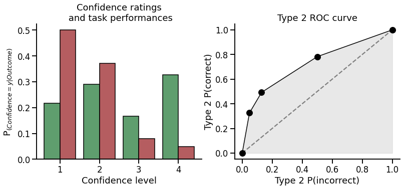
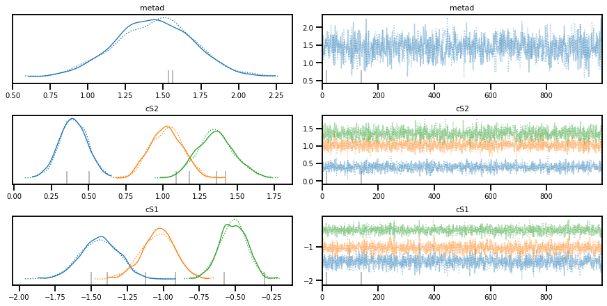

.. image:: https://img.shields.io/badge/License-GPL%20v3-blue.svg
  :target: https://github.com/LegrandNico/metadPy/blob/master/LICENSE

.. image:: https://badge.fury.io/py/metadPy.svg
  :target: https://badge.fury.io/py/metadPy

.. image:: https://travis-ci.com/LegrandNico/metadPy.svg?branch=master
  :target: https://travis-ci.com/LegandNico/metadPy

.. image:: https://codecov.io/gh/LegrandNico/metadPy/branch/master/graph/badge.svg
  :target: https://codecov.io/gh/LegrandNico/metadPy

.. image:: https://img.shields.io/badge/code%20style-black-000000.svg
  :target: https://github.com/psf/black

.. image:: http://www.mypy-lang.org/static/mypy_badge.svg
  :target: http://mypy-lang.org/

================

.. image::  https://github.com/LegrandNico/metadPy/blob/master/images/logo.png

================

metadPy
=======

metadPy is an open-source Python package dedicated to behavioural data
analysis for metacognition research.

It is aimed to provide simple yet powerful functions to compute standard
index and metric of signal detection theory (SDT) and metacognitive
efficiency (meta-d’ and hierarchical meta-d’)  [1]_ [2]_ [3]_, only provided with a data
frame encoding task performances and confidence ratings at the trial
level.

metadPy is written in Python 3 and use mostly Numpy, Scipy and `Pandas <https://pandas.pydata.org/>`_.
Computing meta-d’ using maximum likelihood estimation (MLE) is based on
Scipy. Hierarchical Bayesian modelling of meta-d’ and m-ratio is based
on `PyMC3 <https://docs.pymc.io/>`_.

Installation
============

metadPy can be installed using pip:

.. code-block:: shell

  pip install git+https://github.com/LegrandNico/metadPy.git

The following packages are required:

* Numpy (>=1.15)
* SciPy (>=1.3.0)
* Pandas (>=0.24)
* Matplotlib (>=3.0.2)
* Seaborn (>=0.9.0)
* PyMC3 (>=3.8)

Why metadPy?
============

metadPy refers to meta-d’ (meta-d prime), which is a behavioural metric
commonly used in consciousness metacognition research and reflecting
metacognitive efficiency (i.e the relationship between subjective
reports and objective behaviour).

metadPy aims to be a Python equivalent of the hMeta-d toolbox (available
in Matlab and R). It tries to make these models available to a broader
open-source ecosystem and to ease their use via modern (cloud) computing
interfaces using either CPU or GPU. While several packages already exist
in Python and other languages to compute signal detection theory
metrics, the Bayesian modelling of confidence data, a prominent method
proposed by Steve Fleming [3]_ to analyse task performance and
confidence ratings, is based on JAGS, which does not support GPU
computing and rely on a Gibbs sampler to explore the posterior
distribution. Because it relies on PyMC3 and Theano, metadPy can easily
be parallelized and use a broader variety of MCMC sampling algorithms
(comprising NUTS).

For an extensive introduction to metadPy, you can navigate the following
notebooks that are Python adaptations of the introduction to the hMeta-d
toolbox written in Matlab by Olivia Faul for the Zurich Computational
Psychiatry course (see `this
link <https://github.com/metacoglab/HMeta-d/tree/master/CPC_metacog_tutorial>`__).

1. What metacognition looks like? |Open In Colab| |View the notebook|

2. Fitting the model |image1| |image2|

3. Hierarchical Bayesian model of metacognition

Or just follow the quick tour below.

.. |Open In Colab| image:: https://colab.research.google.com/assets/colab-badge.svg
   :target: https://github.com/LegrandNico/metadPy/blob/master/notebooks/1%20-%20What%20metacognition%20looks%20like.ipynb
.. |View the notebook| image:: https://img.shields.io/badge/render-nbviewer-orange.svg
   :target: https://github.com/LegrandNico/metadPy/blob/master/notebooks/1%20-%20What%20metacognition%20looks%20like.ipynb
.. |image1| image:: https://colab.research.google.com/assets/colab-badge.svg
   :target: https://github.com/LegrandNico/metadPy/blob/master/notebooks/2%20-%20Fitting%20the%20model.ipynb
.. |image2| image:: https://img.shields.io/badge/render-nbviewer-orange.svg
   :target: https://github.com/LegrandNico/metadPy/blob/master/notebooks/2%20-%20Fitting%20the%20model.ipynb

Importing data
==============

Classical metacognition experiments contain two phases: task performance
and confidence ratings. The task performance could for example be the
ability to distinguish the presence of a dot on the screen. By relating
trials where stimuli are present or absent and the response provided by
the participant (Can you see the dot: yes/no), it is possible to obtain
the accuracy. The confidence rating is proposed to the participant when
the response is made and should reflect how certain the participant is
about his/her judgement.

An ideal observer would always associate very high confidence ratings
with correct task-I responses, and very low confidence ratings with an
incorrect task-1 response, while a participant with a low metacognitive
efficiency will have a more mixed response pattern.

A minimal metacognition dataset will therefore consist in a data frame
populated with 5 columns: \* ``Stimuli``: Which of the two stimuli was
presented [0 or 1]. \* ``Response``: The response made by the
participant [0 or 1]. \* ``Accuracy``: Was the participant correct? [0
or 1]. \* ``Confidence``: The confidence level [can be continuous or
discrete rating]. \* ``ntrial``: The trial number.

Due to the logical dependence between the ``Stimuli``, ``Responses`` and
``Accuracy`` columns, in practice only two of those columns are
necessary, the third being deduced from the others. Most of the
functions in ``metadPy`` will accept DataFrames containing only two of
these columns, and will automatically infer the missing information.
Similarly, as the metacognition models described here does not
incorporate the temporal dimension, the trial number is optional.

``metadPy`` includes a simulation function that will let you create one
such data frame for one or many participants and condition, controlling
for a variety of parameters. Here, we will simulate 200 trials from
participant having ``d=1`` and ``c=0`` (task performances) and a
``meta-d=1.5`` (metacognitive sensibility). The confidence ratings were
provided using a 1-to-4 rating scale.

.. code:: ipython3

    from metadPy.utils import responseSimulation      
    simulation = responseSimulation(d=1, metad=1.5, c=0, 
                                    nRatings=4, nTrials=200, as_df=True)
    simulation

.. raw:: html

    

    
    <table border="1" class="dataframe">
      <thead>
        <tr style="text-align: right;">
          <th></th>
          <th>Stimuli</th>
          <th>Responses</th>
          <th>Accuracy</th>
          <th>Confidence</th>
          <th>nTrial</th>
        </tr>
      </thead>
      <tbody>
        <tr>
          <th>0</th>
          <td>0</td>
          <td>0</td>
          <td>1</td>
          <td>1</td>
          <td>0</td>
        </tr>
        <tr>
          <th>1</th>
          <td>0</td>
          <td>1</td>
          <td>0</td>
          <td>2</td>
          <td>1</td>
        </tr>
        <tr>
          <th>2</th>
          <td>1</td>
          <td>0</td>
          <td>0</td>
          <td>4</td>
          <td>2</td>
        </tr>
        <tr>
          <th>3</th>
          <td>0</td>
          <td>0</td>
          <td>1</td>
          <td>1</td>
          <td>3</td>
        </tr>
        <tr>
          <th>4</th>
          <td>1</td>
          <td>1</td>
          <td>1</td>
          <td>1</td>
          <td>4</td>
        </tr>
        <tr>
          <th>...</th>
          <td>...</td>
          <td>...</td>
          <td>...</td>
          <td>...</td>
          <td>...</td>
        </tr>
        <tr>
          <th>195</th>
          <td>0</td>
          <td>0</td>
          <td>1</td>
          <td>1</td>
          <td>195</td>
        </tr>
        <tr>
          <th>196</th>
          <td>1</td>
          <td>1</td>
          <td>1</td>
          <td>3</td>
          <td>196</td>
        </tr>
        <tr>
          <th>197</th>
          <td>0</td>
          <td>0</td>
          <td>1</td>
          <td>1</td>
          <td>197</td>
        </tr>
        <tr>
          <th>198</th>
          <td>1</td>
          <td>1</td>
          <td>1</td>
          <td>4</td>
          <td>198</td>
        </tr>
        <tr>
          <th>199</th>
          <td>1</td>
          <td>1</td>
          <td>1</td>
          <td>4</td>
          <td>199</td>
        </tr>
      </tbody>
    </table>
    
200 rows × 5 columns

    

.. code:: ipython3

    from metadPy.utils import trials2counts
    nR_S1, nR_S2 = trials2counts(
        data=simulation, stimuli="Stimuli", accuracy="Accuracy",
        confidence="Confidence", nRatings=4)

Data visualization
------------------

You can easily visualize metacognition results using one of the plotting
functions. Here, we will use the ``plot_confidence`` and the
``plot_roc`` functions to visualize the metacognitive performance of our
participant.

.. code:: ipython3

    from metadPy.plotting import plot_confidence, plot_roc

.. code:: ipython3

    fig, axs = plt.subplots(1, 2, figsize=(13, 5))
    plot_confidence(nR_S1, nR_S2, ax=axs[0])
    plot_roc(nR_S1, nR_S2, ax=axs[1])
    sns.despine()

Signal detection theory (SDT)
=============================

.. code:: ipython3

    from metadPy.sdt import criterion, dprime, rates, roc_auc, scores

All metadPy functions are registred as Pandas flavors (see
`pandas-flavor <https://pypi.org/project/pandas-flavor/>`__), which
means that the functions can be called as a method from the result data
frame. When using the default columns names (``Stimuli``, ``Response``,
``Accuracy``, ``Confidence``), this significantly reduces the length of
the function call, making your code more clean and readable.

-  Criterion

.. code:: ipython3

    simulation.criterion()

.. parsed-literal::

    5.551115123125783e-17

-  d prime

.. code:: ipython3

    simulation.dprime()

.. parsed-literal::

    0.9917006946949065

-  Hits rate and false alarms rate

.. code:: ipython3

    simulation.rates()

.. parsed-literal::

    (0.69, 0.31)

-  ROC AUC

.. code:: ipython3

    simulation.roc_auc(nRatings=4)

.. parsed-literal::

    0.7106274007682458

-  Scores: hits, misses, fas, crs

.. code:: ipython3

    simulation.scores()

.. parsed-literal::

    (69, 31, 31, 69)

Criterion
---------

Estimating meta dprime using Maximum Likelyhood Estimates (MLE)
===============================================================

.. code:: ipython3

    from metadPy.sdt import metad
    
    metad = metad(data=simulation, nRatings=4, stimuli='Stimuli',
                  accuracy='Accuracy', confidence='Confidence')
    print('meta-d\' = {str(metad["meta_da"])}')

.. parsed-literal::

    /usr/local/lib/python3.6/dist-packages/scipy/optimize/_hessian_update_strategy.py:187: UserWarning: delta_grad == 0.0. Check if the approximated function is linear. If the function is linear better results can be obtained by defining the Hessian as zero instead of using quasi-Newton approximations.
      'approximations.', UserWarning)
    

.. parsed-literal::

    `xtol` termination condition is satisfied.
    Number of iterations: 154, function evaluations: 1896, CG iterations: 289, optimality: 2.45e-06, constraint violation: 0.00e+00, execution time: 1e+01 s.
    meta-d' = {str(metad["meta_da"])}
    

Estimating meta-dprime using hierarchical Bayesian modeling
===========================================================

Subject level
-------------

.. code:: ipython3

    import pymc3 as pm
    from metadPy.hierarchical import hmetad

.. code:: ipython3

    model, trace = hmetad(data=simulation, nRatings=4, stimuli='Stimuli',
                          accuracy='Accuracy', confidence='Confidence')

.. parsed-literal::

    Auto-assigning NUTS sampler...
    Initializing NUTS using jitter+adapt_diag...
    Sequential sampling (2 chains in 1 job)
    NUTS: [cS2_hn, cS1_hn, metad, d1, c1]
    

.. raw:: html

    
    

        
      <progress value='2000' class='' max='2000' style='width:300px; height:20px; vertical-align: middle;'></progress>
      100.00% [2000/2000 00:08<00:00 Sampling chain 0, 1 divergences]
    

    

.. raw:: html

    
    

        
      <progress value='2000' class='' max='2000' style='width:300px; height:20px; vertical-align: middle;'></progress>
      100.00% [2000/2000 00:08<00:00 Sampling chain 1, 1 divergences]
    

    

.. parsed-literal::

    Sampling 2 chains for 1_000 tune and 1_000 draw iterations (2_000 + 2_000 draws total) took 17 seconds.
    /usr/local/lib/python3.6/dist-packages/arviz/data/io_pymc3.py:314: UserWarning: Could not compute log_likelihood, it will be omitted. Check your model object or set log_likelihood=False
      warnings.warn(warn_msg)
    There was 1 divergence after tuning. Increase `target_accept` or reparameterize.
    There were 2 divergences after tuning. Increase `target_accept` or reparameterize.
    

.. code:: ipython3

    pm.traceplot(trace, var_names=['metad', 'cS2', 'cS1']);

.. code:: ipython3

    pm.summary(trace)

.. raw:: html

    

    
    <table border="1" class="dataframe">
      <thead>
        <tr style="text-align: right;">
          <th></th>
          <th>mean</th>
          <th>sd</th>
          <th>hdi_3%</th>
          <th>hdi_97%</th>
          <th>mcse_mean</th>
          <th>mcse_sd</th>
          <th>ess_mean</th>
          <th>ess_sd</th>
          <th>ess_bulk</th>
          <th>ess_tail</th>
          <th>r_hat</th>
        </tr>
      </thead>
      <tbody>
        <tr>
          <th>metad</th>
          <td>1.440</td>
          <td>0.266</td>
          <td>0.936</td>
          <td>1.925</td>
          <td>0.008</td>
          <td>0.006</td>
          <td>1163.0</td>
          <td>1157.0</td>
          <td>1164.0</td>
          <td>913.0</td>
          <td>1.0</td>
        </tr>
        <tr>
          <th>cS1[0]</th>
          <td>-1.442</td>
          <td>0.136</td>
          <td>-1.685</td>
          <td>-1.183</td>
          <td>0.004</td>
          <td>0.003</td>
          <td>1213.0</td>
          <td>1203.0</td>
          <td>1210.0</td>
          <td>1519.0</td>
          <td>1.0</td>
        </tr>
        <tr>
          <th>cS1[1]</th>
          <td>-1.034</td>
          <td>0.116</td>
          <td>-1.253</td>
          <td>-0.822</td>
          <td>0.003</td>
          <td>0.002</td>
          <td>1116.0</td>
          <td>1116.0</td>
          <td>1115.0</td>
          <td>1284.0</td>
          <td>1.0</td>
        </tr>
        <tr>
          <th>cS1[2]</th>
          <td>-0.515</td>
          <td>0.094</td>
          <td>-0.690</td>
          <td>-0.338</td>
          <td>0.003</td>
          <td>0.002</td>
          <td>1393.0</td>
          <td>1377.0</td>
          <td>1398.0</td>
          <td>1260.0</td>
          <td>1.0</td>
        </tr>
        <tr>
          <th>cS2[0]</th>
          <td>0.399</td>
          <td>0.093</td>
          <td>0.233</td>
          <td>0.586</td>
          <td>0.002</td>
          <td>0.002</td>
          <td>1566.0</td>
          <td>1461.0</td>
          <td>1556.0</td>
          <td>1189.0</td>
          <td>1.0</td>
        </tr>
        <tr>
          <th>cS2[1]</th>
          <td>1.026</td>
          <td>0.110</td>
          <td>0.832</td>
          <td>1.233</td>
          <td>0.003</td>
          <td>0.002</td>
          <td>1466.0</td>
          <td>1435.0</td>
          <td>1488.0</td>
          <td>1337.0</td>
          <td>1.0</td>
        </tr>
        <tr>
          <th>cS2[2]</th>
          <td>1.357</td>
          <td>0.124</td>
          <td>1.136</td>
          <td>1.597</td>
          <td>0.003</td>
          <td>0.002</td>
          <td>1503.0</td>
          <td>1503.0</td>
          <td>1504.0</td>
          <td>1686.0</td>
          <td>1.0</td>
        </tr>
      </tbody>
    </table>
    

References
==========

.. [1] Maniscalco, B., & Lau, H. (2014). Signal Detection Theory Analysis of Type 1 and Type 2 Data: Meta-d′, Response-Specific Meta-d′, and the Unequal Variance SDT Model. In The Cognitive Neuroscience of Metacognition (pp. 25–66). Springer Berlin Heidelberg. https://doi.org/10.1007/978-3-642-45190-4_3 

.. [2] Fleming, S. M., & Lau, H. C. (2014). How to measure metacognition. Frontiers in Human Neuroscience, 8. https://doi.org/10.3389/fnhum.2014.00443

.. [3] Fleming, S.M. (2017) HMeta-d: hierarchical Bayesian estimation of metacognitive efficiency from confidence ratings, Neuroscience of Consciousness, 3(1) nix007, https://doi.org/10.1093/nc/nix007
